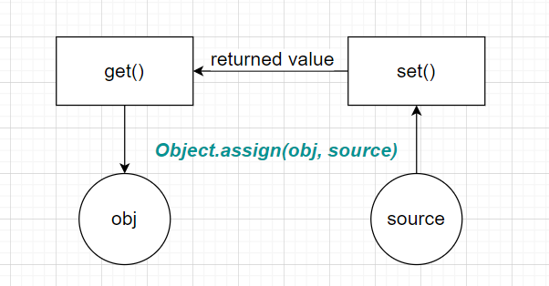

# Object.property

## Object.assign()

### Tags

Object.assign/accessor property/

### Q

```JavaScript
let foo = {
  print: () => {
    console.log(this)
  },
  get name() {
    return "foo"
  }
}

let bar = {
  get name() {
    return "bar"
  },
  get error() {
      throw new Error();
  },
  afterError: "none"
}


let res = {
  set name(val) {
    this.name_ = val
  },
  get name() {
    return this.name_
  },
}

try {
  Object.assign(res, foo, bar)
} catch(e) {
  console.log("there is an error")
}

console.log(res)
```

### Answer

```JavaScript
// notice that ignore is not added
there is an error
{ name: [Getter/Setter], print: [Function: print], name_: 'bar' }
```

### Knowledge



If an _error_ was thrown during the process, it will be partily completed rather than "rolling back"
