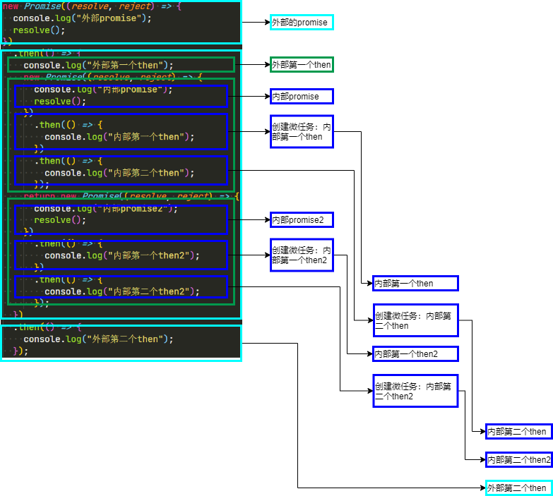

## What is the output of the code about Promise

### Tags

Promise/micro tasks/

### Q

```javascript
new Promise((resolve, reject) => {
  console.log("外部promise");
  resolve();
})
  .then(() => {
    console.log("外部第一个then");
    new Promise((resolve, reject) => {
      console.log("内部promise");
      resolve();
    })
      .then(() => {
        console.log("内部第一个then");
      })
      .then(() => {
        console.log("内部第二个then");
      });
    return new Promise((resolve, reject) => {
      console.log("内部promise2");
      resolve();
    })
      .then(() => {
        console.log("内部第一个then2");
      })
      .then(() => {
        console.log("内部第二个then2");
      });
  })
  .then(() => {
    console.log("外部第二个then");
  });
```

### Answer

```
外部promise
外部第一个then
内部promise
内部promise2
内部第一个then
内部第一个then2
内部第二个then
内部第二个then2
外部第二个then
```



### Knowledge

1. 每一个 task 的执行是同步的，产生的新任务会放进队列里

### Reference

[《深度揭秘 Promise 微任务注册和执行过程》](https://juejin.cn/post/6844903987183894535#heading-5)
